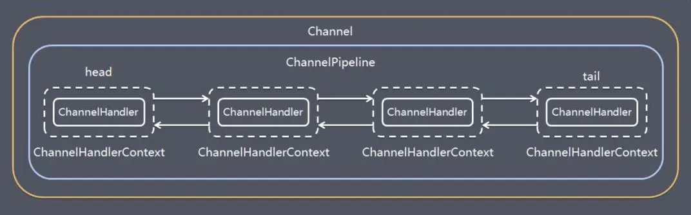

组件和功能
----

## ChannelPipeline

保存 ChannelHandler 的 List，用于处理或拦截 Channel 的入站事件和出站操作。  
ChannelPipeline 实现了一种高级形式的拦截过滤器模式，使用户可以完全控制事件的处理方式，以及 Channel 中各个的 ChannelHandler 如何相互交互。  
下图引用 Netty 的 Javadoc 4.1 中 ChannelPipeline 的说明，描述了 ChannelPipeline 中 ChannelHandler 通常如何处理 I/O 事件。  
I/O 事件由 ChannelInboundHandler 或 ChannelOutboundHandler 处理，并通过调用 ChannelHandlerContext 中定义的事件传播方法。  
例如 ChannelHandlerContext.fireChannelRead（Object）和 ChannelOutboundInvoker.write（Object）转发到其最近的处理程序。

入站事件由自下而上方向的入站处理程序处理，如图左侧所示。  
入站 Handler 处理程序通常处理由图底部的 I/O 线程生成的入站数据。  
通常通过实际输入操作（例如 SocketChannel.read（ByteBuffer））从远程读取入站数据。  
出站事件由上下方向处理，如图右侧所示。出站 Handler 处理程序通常会生成或转换出站传输，例如 write 请求。  
I/O 线程通常执行实际的输出操作，例如 SocketChannel.write（ByteBuffer）。

在 Netty 中每个 Channel 都有且仅有一个 ChannelPipeline 与之对应，它们的组成关系如下：

一个 Channel 包含了一个 ChannelPipeline，而 ChannelPipeline 中又维护了一个由 ChannelHandlerContext 组成的双向链表，并且每个 ChannelHandlerContext 中又关联着一个 ChannelHandler。  
入站事件和出站事件在一个双向链表中，入站事件会从链表 head 往后传递到最后一个入站的 handler，出站事件会从链表 tail 往前传递到最前一个出站的 handler，两种类型的 handler 互不干扰。

## 协议支持

## 粘连包解决方案

## 零拷贝

## 基于Buffer

*  传统的IO面向字节流或字符流，以流式的方式顺序地从一个 Stream 中读取一个或多个字节, 因此也就不能随意改变读取指针的位置。
*  在NIO中，抛弃了传统的I/O流，而是引入了Channel和Buffer的概念。在NIO中，只能从Channel中读取数据到 Buffer 中或将数据从 Buffer 中写入到 Channel。
*  基于Buffer操作不像传统IO的顺序操作，NIO 中可以随意地读取任意位置的数据。
