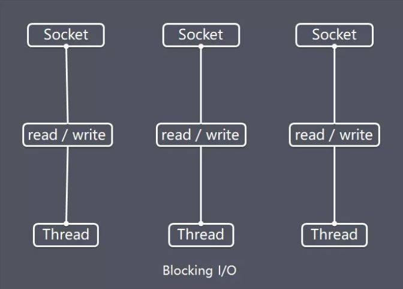

大纲
---

# Netty特性

1. 概述：Netty是一个高性能、异步事件驱动的NIO框架，它提供了对TCP、UDP和文件传输的支持，作为一个异步NIO框架，Netty的所有IO操作都是异步非阻塞的，  
        通过Future-Listener机制，用户可以方便的主动获取或者通过通知机制获得IO操作结果。
2. 优势
   * API使用简单，开发门槛低
   * 功能强大，预置了多种编解码功能，支持多种主流协议
   * 定制能力强，可以通过ChannelHandler对通信框架进行灵活地扩展
   * 高性能且成熟、稳定，经历了大规模商业应用考验

# 关键技术点和架构

## IO模型

1. BIO
   特点：
   * 每个请求都需要独立的线程完成 数据的读取、业务处理、数据写出 等完整操作
   * 当请求量较大时需要创建大量线程来处理连接，系统资源占用较大
   * 连接建立后，如果当前线程暂时没有数据可读/写，线程就会阻塞在read()操作上，浪费线程资源（但没有浪费CPU）

2. 

## 线程模型

Netty实现了Reactor线程模型，并且从简单到复杂提供了对Reactor三种形式的支持

1. 单线程模型
   Reactor单线程模型指的是所有的**IO**操作都在同一个NIO线程上面完成，这个NIO线程的职责如下：
   * 作为 NIO 服务端/客户端，接收客户端/服务端的 TCP 连接
   * **读取**通信对端的请求或者应答消息
   * 向通信对端**发送**消息请求或者应答消息
   PS：NIO线程的数据读取和发送都包括编解码工作

   存疑：
   * NIO线程到底负不负责业务的处理，如果不负责那么下文的串行无锁化是怎么实现的？
   * 以及如果不负责的话不就和Redis的单线程模型一样了吗，都只有网络和内存操作！
   结论：
   * 除IO操作外，业务逻辑处理交由业务层处理，处理结果通过绑定的Channel产生事件以通知到Reactor线程 ？？？

   对于一些小容量应用场景，可以使用单线程模型。但是对于高负载、大并发的应用场景却不合适，主要原因如下：
   * 

   补充知识：Redis中的Reactor
   Redis使用的就是单线程的Reactor模型，所有IO操作都由单一线程执行。
   因为Redis的操作都在内存中完成，所以能够支持高性能、高并发，但对于普通的网络应用而言必然需要内存以外的操作，

2. 主从模型

3. 主从多线程模型

4. 串行无锁化

## 协议支持

## 粘连包解决方案

## 零拷贝

