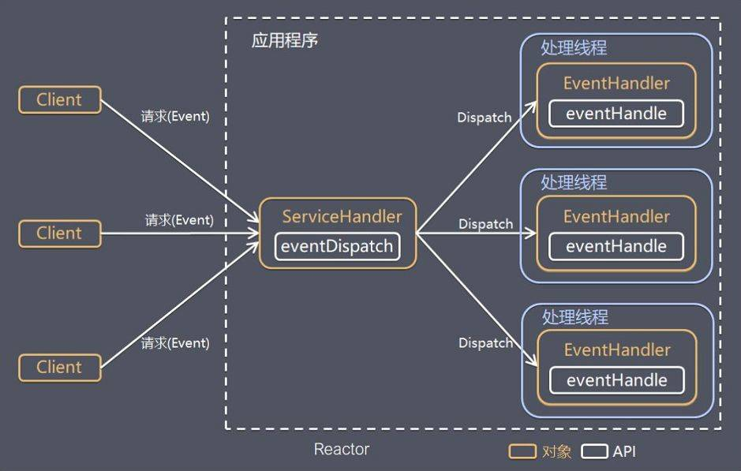
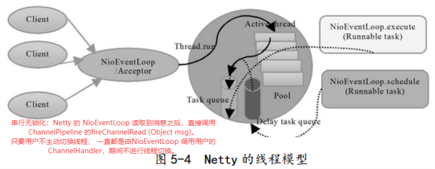

大纲
---

# Netty特性

1. 概述：Netty是一个高性能、异步事件驱动的NIO框架，它提供了对TCP、UDP和文件传输的支持，作为一个异步NIO框架，Netty的所有IO操作都是异步非阻塞的，  
        通过Future-Listener机制，用户可以方便的主动获取或者通过通知机制获得IO操作结果。
2. 优势
   * API使用简单，开发门槛低
   * 功能强大，预置了多种编解码功能，支持多种主流协议
   * 定制能力强，可以通过ChannelHandler对通信框架进行灵活地扩展
   * 高性能且成熟、稳定，经历了大规模商业应用考验

# 关键技术点和架构

## IO模型

1. 阻塞IO模型
   特点：
   * 每个请求都需要独立的线程完成 数据的读取、业务处理、数据写出 等完整操作
   * 当请求量较大时需要创建大量线程来处理连接，系统资源占用较大
   * 连接建立后，如果当前线程暂时没有数据可读/写，线程就会阻塞在read()操作上，浪费线程资源（但没有浪费CPU）

2. IO复用模型

   在I/O复用模型中，使用selector.select()，这个函数也会使进程阻塞，但是和阻塞 I/O 所不同的是这两个函数可以同时阻塞多个 I/O 操作。  
   而且可以同时对多个读操作，多个写操作的 I/O 函数进行检测，直到有数据可读或可写时，才真正调用 I/O 操作函数。

   Netty的非阻塞I/O的实现关键是基于I/O复用模型，这里用 Selector 对象表示：

> Netty 的 IO 线程 NioEventLoop 由于聚合了多路复用器 Selector，可以同时并发处理成百上千个客户端连接。  
  当线程从某客户端 Socket 通道进行读写数据时，若没有数据可用时，该线程可以进行其他任务。  
  线程通常将非阻塞 IO 的空闲时间用于在其他通道上执行 IO 操作，所以单独的线程可以管理多个输入和输出通道。  
  由于读写操作都是非阻塞的，这就可以充分提升 IO 线程的运行效率，避免由于频繁 I/O 阻塞导致的线程挂起。  
  一个 I/O 线程可以并发处理 N 个客户端连接和读写操作，这从根本上解决了传统同步阻塞 I/O 一连接一线程模型，架构的性能、弹性伸缩能力和可靠性都得到了极大的提升。

## 事件驱动

通常，设计一个事件驱动模型的程序有两种思路：
* 轮询方式
  - 线程不断轮询，访问事件发生源有没有发生事件，有事件产生就调用事件处理逻辑
* 事件驱动方式
  - 发生事件，主线程把事件放入事件队列
  - 其他线程不断循环消费事件队列中的事件，调用对应的处理逻辑处理事件
  - 处理完成后发出事件，触发下一步操作
  - 事件驱动也称消息通知方式，其实是设计模式中观察者模式的思路

  模型图：
  

  可见事件驱动模型包括4个基本组件：
  > 事件队列（event queue）：接收事件的入口，存储待处理事件。  
  > 分发器（event mediator）：将不同的事件分发到不同的业务逻辑单元。  
  > 事件通道（event channel）：分发器与处理器之间的联系渠道。  
  > 事件处理器（event processor）：实现业务逻辑，处理完成后会发出事件，触发下一步操作。

  相对传统轮询方式，事件驱动具有以下优点：
  > 可扩展性好：分布式的异步架构，事件处理器之间高度解耦，可以方便扩展事件处理逻辑。  
  > 高性能：基于队列暂存事件，能方便并行异步处理事件。

## 线程模型

Reactor模型的2个关键组成：
* Reactor
  - Reactor在一个单独的线程中运行，负责监听和分发事件，分发给适当的处理程序来对IO事件做出反应。
  - 注1：连接就绪、读就绪、写就绪都属于IO事件，因此ServerSocketChannel和SocketChannel可以注册到同一个Reactor上
  - 注2：NIO通过聚合Selector事件选择器实现Reactor模式
* Handlers
  - 业务逻辑处理器，处理程序提交的IO事件
  - 注1：在单reactor单线程模型中，Reactor线程兼任Handler

Netty实现了Reactor线程模型，并且从简单到复杂提供了对Reactor三种形式的支持

1. 单reactor单线程

   Reactor单线程模型指的是所有的IO + 业务操作都在同一个NIO线程上面完成，这个NIO线程的职责如下：
   * 作为 NIO 服务端/客户端，接收客户端/服务端的 TCP 连接
   * 读取通信对端的请求或者应答消息
   * 处理业务逻辑
   * 向通信对端发送消息请求或者应答消息
   对于一些小容量应用场景，可以使用单线程模型。但是对于高负载、大并发的应用场景却不合适

**Redis中的Reactor**
> Redis使用的就是单线程的Reactor模型，所有IO操作都由单一线程执行。  
> 因为Redis的操作都在内存中完成，所以能够支持高性能、高并发，但对于普通的网络应用而言必然需要内存以外的操作

2. 单reactor多线程 + 主从reactor多线程

见reactor模块的线程模型.md

**特别说明**：  
虽然Netty的线程模型基于Reactor主从多线程模型，借用了MainReactor和SubReactor的结构，但在实际实现中SubReactor和Worker线程使用的同一个线程池
对server.group(bossGroup, workerGroup)的说明：
> bossGroup线程池只是在Bind某个端口后，获得其中一个线程作为MainReactor，专门处理端口的Accept事件，**每个端口对应一个Boss线程**
> workerGroup 线程池会被各个SubReactor和Worker线程充分利用

4. 串行无锁化

为了尽可能提升性能，Netty在很多地方进行了无锁化设计。  
例如在 I/O 线程内部进行串行操作，避免多线程竞争导致的性能下降问题。表面上看，  
串行化设计似乎 CPU 利用率不高，并发程度不够。但是，通过调整 NIO 线程池的线程参数，  
可以同时启动多个串行化的线程并行运行，这种局部无锁化的串行线程设计相比一个队列多个工作线程的模型性能更优。

  

Netty的NioEventLoop读取到消息之后，直接调用 ChannelPipeline 的fireChannelRead (Object msg)。  
只要用户不主动切换线程， 一直都是由NioEventLoop 调用用户的 ChannelHandler，期间不进行线程切换。  
这种串行化处理方式避免了多线程操作导致的锁的竞争，从性能角度看是最优的。

## 协议支持

## 粘连包解决方案

## 基于Buffer

*  传统的IO面向字节流或字符流，以流式的方式顺序地从一个 Stream 中读取一个或多个字节, 因此也就不能随意改变读取指针的位置。
*  在NIO中，抛弃了传统的I/O流，而是引入了Channel和Buffer的概念。在NIO中，只能从Channel中读取数据到 Buffer 中或将数据从 Buffer 中写入到 Channel。
*  基于Buffer操作不像传统IO的顺序操作，NIO 中可以随意地读取任意位置的数据。

## 零拷贝

## pipeline

