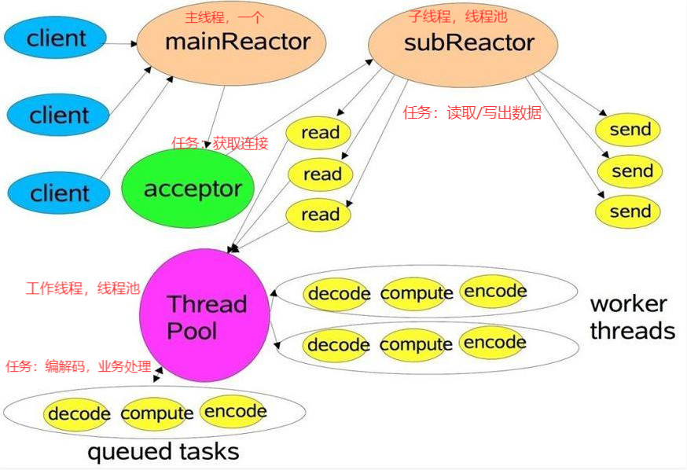

根据使用SameThreadDispatcher还是ThreadPoolDispatcher，可能有两个或三个线程池，现对程序执行过程说明如下：

1. 初始化
   * 初始化App对象，选择事件分发器(SameThreadDispatcher/ThreadPoolDispatcher)
   * 初始化NioReactor实例(作为mainReactor)
     - 打开selector：this.selector = Selector.open();
     - 初始化NioReactor实例数组(作为subReactors)
       - 打开selector：this.selector = Selector.open();
       - 设置事件分发器：this.dispatcher = dispatcher; 注：mainReactor事实上用不到事件分发器，因为和subReactor共用构造函数，所以mainReactor初始化时也设置了事件分发器
       - 初始化两个线程池：mainService、subService
   * 打开NioServerSocketChannel(可同时支持多个不同类型)并绑定到指定端口，然后注册到mainReactor的selector上
   * 执行start()方法分别启动mainReactor和subReactor的事件循环，分派到不同的线程池
     -  mainService
         -> eventLoop()
          -> selector.select(time)
        - mainReactor中的selector开始获取已注册到其中的NioServerSocketChannel上的事件，并将新连接注册到subReactor上
     -  subService
         -> subReactors.forEach().eventLoop()
          -> selector.select(time)
        - subReactor也通过其selector开始监听事件，但此时还没有SocketChannel注册到其上

2. 处理请求
   * 连接
     - 新连接到达指定端口，mainSelector线程获取到ServerSocketChannel上的连接事件
     - 处理连接事件初始化一个SocketChannel
     - 将SocketChannel实例注册到任意一个subSelector上，关注事件为readable
     - 后续读写工作由subReactor线程处理
   * 读
     - 获取到读就绪事件
     - 处理读就绪，从channel中读取数据
     - 通过dispatcher分发器将数据分发给对应的**handler实例(已和channel绑定)**，根据分发器的不同有两种处理方式：
       - SameThreadDispatcher：channel.getHandler().handleChannelRead(channel, readObject, key);
         > 单线程处理方式：使用subReactor当前线程处理业务逻辑
       - ThreadPoolDispatcher：executorService.execute(() -> channel.getHandler().handleChannelRead(channel, readObject, key));
         > 线程池处理方式：将handleChannelRead作为任务交给工作线程池去处理
     - handler处理完业务之后进行响应
       - channel.write(replyPacket, key);
         > 这个方法将响应数据写入channel并将channel关注的事件改为writeable
   * 写
     - subReactor线程从channel获取到写事件，将数据写出

线程模型图：

